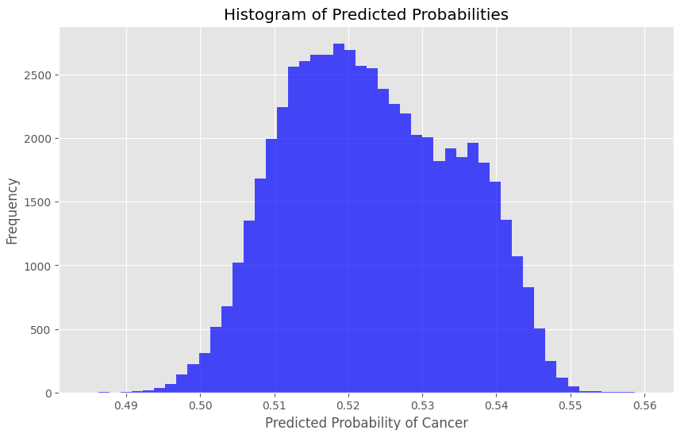

# CNN Image Classification

This project builds a CNN model in pytorch for image classification. The attached workbook evaluates CNN to improve detection of malignant cancer cells in a large set of images that contain healthy and malignant cells that are labeled as such.
The source data for the notebook can be found at: https://www.kaggle.com/competitions/histopathologic-cancer-detection/data. There are >200,000 images in this data set.

The model architecture features a series of convolutional layers designed to progressively increase the depth while maintaining spatial dimensions using padding. Each convolutional layer is followed by batch normalization and ReLU activation, enhancing training stability and non-linearity. After each set of convolutions, spatial dimension reduction is achieved through max pooling, condensing the feature maps and reducing computational load. The network concludes with fully connected layers, transforming the learned spatial features into class predictions, and incorporates dropout to mitigate overfitting. Hyperparameter tuning is conducted via learning rate scheduling.

This histogram of predicted probabilities illustrates that the model predominantly assigns probabilities close to 0.50 with a peak slightly above this midpoint. Given that the actual dataset contains only negative cases (all 0's, no 1's), the ideal model should produce probabilities skewed significantly towards 0. Therefore the model is overestimating the likelihood of cancer.

To improve model performance, next steps would be to increase sample size and epochs, increase batch size, and then incrementally tune model parameters, starting with learning rate.

